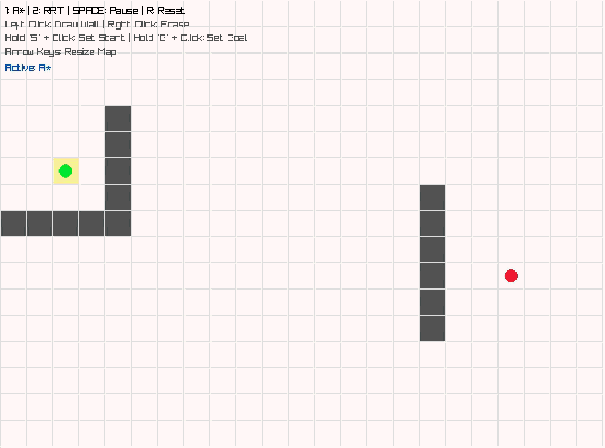
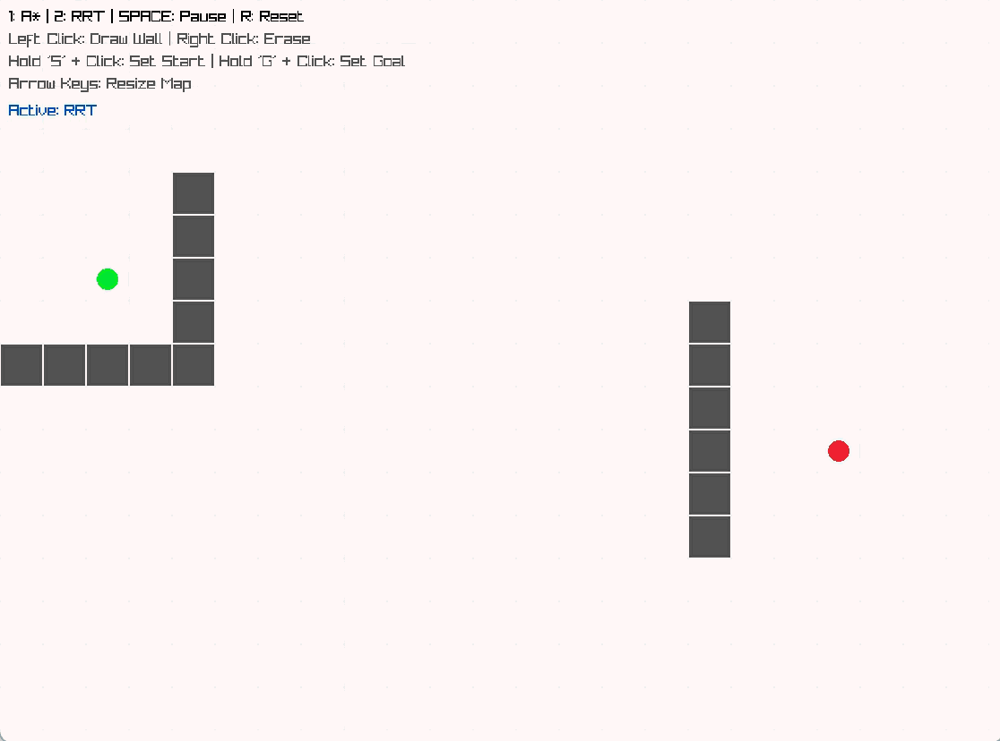

# 2D Robot Motion Planner

I built this interactive visualizer as a personal summer project to explore the mechanics behind autonomous pathfinding and deepen my understanding of C++ software architecture. This tool visualizes the trade-offs between grid-based (A*) and sampling-based (RRT) algorithms used in modern robotics.

## Algorithm Comparison

Below is a comparison of how each algorithm navigates the same custom environment.

| A\* (A-Star) Search | Rapidly-exploring Random Tree (RRT) |
| :---: | :---: |
|  |  |
| **Optimal but Exhaustive:** Explores the grid uniformly using a heuristic. Always finds the shortest path, but can be computationally expensive in large, open spaces. | **Fast but Suboptimal:** Uses random sampling to rapidly explore high-dimensional spaces. Finds a path very quickly, but the resulting path is often jagged and not the shortest possible route. |

## Features

* **Dual Algorithm Engine:** Switch seamlessly between A* (A-Star) heuristic search and Rapidly-exploring Random Tree (RRT) sampling algorithms.
* **Interactive Sandbox:** Draw and erase custom obstacles dynamically using mouse controls.
* **Real-Time Replanning:** Drag and drop the start and goal nodes to watch the algorithms recalculate paths on the fly.
* **Dynamic Environment Resizing:** Expand or shrink the simulation grid at runtime with arrow keys while maintaining proper aspect ratios and cell scaling.
* **Step-by-Step Visualization:** The pathfinding logic runs on a state machine, allowing for controlled frame-by-frame animation of the search space rather than instantaneous computation.

## Controls

| Action | Keybinding / Input |
| :--- | :--- |
| **Start A\* Planner** | `1` |
| **Start RRT Planner** | `2` |
| **Pause / Resume** | `Spacebar` |
| **Reset Board** | `R` |
| **Toggle Fullscreen** | `F` |
| **Draw / Erase Wall** | `Left Click` / `Right Click` |
| **Move Start Node** | Hold `S` + `Left Click` |
| **Move Goal Node** | Hold `G` + `Left Click` |
| **Resize Grid** | `Arrow Keys` |

## What I Learned (Reflection)

The primary goal of this project was to deeply understand the mechanics and practical trade-offs of foundational pathfinding algorithms. Building this visualizer allowed me to observe these differences in real-time:

* **Algorithmic Trade-offs (A\* vs. RRT):** I learned firsthand that while A* guarantees an optimal, shortest path by systematically evaluating grid nodes using a heuristic, it becomes computationally heavy in large, open environments. Conversely, RRT's random sampling approach allows it to rapidly search the space without being constrained by a grid resolution. It finds solutions significantly faster in open areas, but trades optimality for speed, often yielding jagged, unpredictable paths.
* **Practical Robotics Application:** Visualizing the algorithms side-by-side highlighted *when* to apply each in a real-world scenario. A* is highly effective for structured, constrained environments (like a tight maze), whereas sampling-based planners like RRT are better suited for rapid exploration or high-dimensional configuration spaces where compute time is a strict constraint.
* **C++ Architecture & CMake:** Beyond the algorithms, this project served as a practical introduction to modern C++ software architecture. I learned how to transition from simple single-file scripts to a multi-file project using a CMake build system. This included managing dependencies dynamically with `FetchContent` and structuring the C++ algorithms as state machines to allow for frame-by-frame GUI rendering without blocking the main thread.

## Prerequisites

* **C++17** or higher
* **CMake** (3.5+)
* **MSVC / Visual Studio Build Tools** (for Windows)

## Build Instructions

This project uses CMake's `FetchContent` to automatically manage dependencies. You do not need to download Raylib manually; CMake will fetch it directly during the configuration step.

1. Clone the repository and navigate into it:
   ```bash
   git clone https://github.com/Jaydenchan22/2D_Robot_Motion_Planner.git
   cd 2D_Robot_Motion_Planner
   ```

2. Generate the build files:
   ```bash
   cmake -S . -B build
   ```

3. Compile the executable:
   ```bash
   cmake --build build
   ```

4. Run the application:
   ```bash
   .\build\Debug\motion_planner.exe
   ```

## Project Structure

* `include/planner/` - Header files defining the core data structures, environment, and pathfinding classes.
* `src/` - Implementation files for the algorithms (`astar_planner.cpp`, `rrt_planner.cpp`) and the Raylib rendering loop (`main.cpp`).
* `assets/` - Demonstration animations and screenshots.
* `CMakeLists.txt` - Build configuration and dependency fetching.